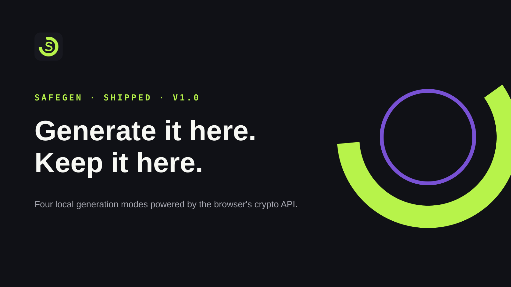

<p align="center"></p>

# SafeGen



SafeGen is my browser-local generator for passwords, passphrases, PINs, and custom patterns. I built it around a simple boundary: a newly generated secret should not need to cross a network before you can use it.

[Open SafeGen](https://safegen.poorvithmp.com) · [View the generator](docs/assets/product.png) · [My portfolio](https://poorvithmp.com)

## Main features

- Random password mode with length and character-set controls.
- Memorable passphrases built from curated word lists.
- Numeric PIN generation.
- Custom pattern generation using letter, number, and symbol tokens.
- Browser cryptography through `crypto.getRandomValues` with rejection sampling and no `Math.random` fallback.
- Entropy, rating, and estimated crack-time guidance.
- Searchable local history for copied items plus locally saved preferences.

## Installation

You need Node.js and npm.

```bash
git clone https://github.com/prvthmpcypher/safegen.git
cd safegen
npm install
npm run dev
```

Create the production bundle with:

```bash
npm run build
```

## How to use it

1. Choose **Random**, **Passphrase**, **PIN Code**, or **Pattern**.
2. Set the controls for that mode.
3. Generate until the result fits the account or situation.
4. Treat the strength panel as guidance, not a promise.
5. Copy the value when ready. Copying is what adds an item to local history.
6. Clear history when you no longer want those copied values stored in this browser profile.

## Privacy and limits

Generated values are not uploaded for generation. Preferences and up to 50 copied items can be stored in this browser's local storage. That history is not encrypted and can be read by someone with access to the same browser profile.

Vercel Analytics is enabled for aggregate site-usage measurement and does not receive generated values.

Entropy and crack-time figures are estimates based on stated assumptions. Real risk also depends on reuse, leaks, predictable choices, an attacker's hardware, and how a service stores credentials. No password is unbreakable.

## Built with

- React and TypeScript
- Vite and Tailwind CSS
- Web Crypto API
- GSAP and Lucide icons
- Vercel Analytics

## Contributing

1. Fork the repository and create a focused branch.
2. Install dependencies with `npm install`.
3. Keep generation code on cryptographic browser primitives; do not add a `Math.random` fallback.
4. Run `npm run lint` and `npm run build` before opening a pull request.
5. Explain changes to randomness, estimates, local history, or privacy boundaries in the pull request.

## Licence

SafeGen is available under the [MIT Licence](LICENSE).

## Author

Built by [Poorvith M P](https://poorvithmp.com). You can also find me on [GitHub](https://github.com/prvthmpcypher).
