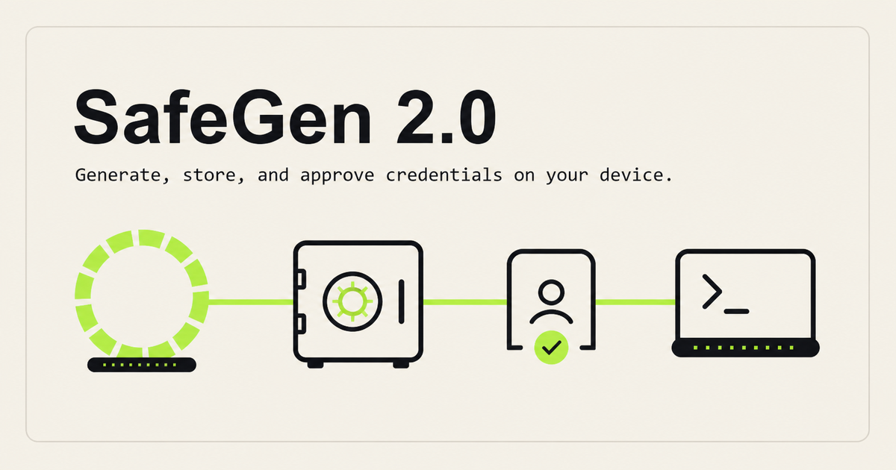

<p align="center"></p>

# SafeGen


SafeGen is my browser-local generator for passwords, passphrases, PINs, and custom patterns. I built it around a simple boundary: a newly generated secret should not need to cross a network before you can use it.



[Open SafeGen](https://safegen.poorvithmp.com) · [View the generator](docs/assets/product.png) · [My portfolio](https://poorvithmp.com) · [](https://www.npmjs.com/package/@poorvithmp/safegen) · [](https://www.npmjs.com/package/@poorvithmp/safegen-cli)

## Main features

- Random password mode with length and character-set controls.
- Memorable passphrases built from curated word lists.
- Numeric PIN generation.
- Custom pattern generation using letter, number, and symbol tokens.
- Browser cryptography through `crypto.getRandomValues` with rejection sampling and no `Math.random` fallback.
- Entropy, rating, and estimated crack-time guidance.
- Searchable local history for copied items plus locally saved preferences.
- A typed, tree-shakeable core package for Node.js and browsers.
- A CLI for generation and an AES-256-GCM encrypted local vault.
- An MCP server that asks the user to unlock and approve every credential request.

## Package and CLI

The original `safegen` package name is already owned by someone else on npm, so SafeGen uses scoped names. The executable is still `safegen`.

```bash
npm install @poorvithmp/safegen
npx @poorvithmp/safegen-cli generate password --length 20 --uppercase --lowercase --numbers --symbols
```

```ts
import { calculateAudit, generatePassword } from '@poorvithmp/safegen';

const credential = generatePassword({ length: 20 });
console.log(calculateAudit(credential));
```

Initialize and use the local vault:

```bash
npx @poorvithmp/safegen-cli vault init
npx @poorvithmp/safegen-cli vault save --service github.com --username poorvith
npx @poorvithmp/safegen-cli vault list
```

The credential value and master password are collected interactively. They are never accepted as command arguments.

## Agent approval bridge

Start the stdio MCP server with:

```bash
npx @poorvithmp/safegen-cli mcp
```

The `safegen_get_credential` tool accepts a service and optional username. SafeGen opens a short-lived local unlock page for the master password, then uses MCP elicitation for an explicit approval. Requests are recorded in `~/.safegen/access.log` without credential values.

An approved credential is returned in the MCP tool result, so it enters the agent's tool context. The vault removes the need to paste it into a chat message, but it cannot make a credential invisible to the agent or host receiving the tool result. Only configure the server in an MCP host you trust.

## Installation

You need Node.js and npm.

```bash
git clone https://github.com/poorvith-mp/safegen.git
cd safegen
npm install
npm run dev
```

Create the production bundle with:

```bash
npm run build
```

## How to use it

1. Choose **Random**, **Passphrase**, **PIN Code**, or **Pattern**.
2. Set the controls for that mode.
3. Generate until the result fits the account or situation.
4. Treat the strength panel as guidance, not a promise.
5. Copy the value when ready. Copying is what adds an item to local history.
6. Clear history when you no longer want those copied values stored in this browser profile.

## Privacy and limits

Generated values are not uploaded for generation. Preferences and up to 50 copied items can be stored in this browser's local storage. That history is not encrypted and can be read by someone with access to the same browser profile.

The website does not run a page-analytics service. Generated values remain in the browser.

Entropy and crack-time figures are estimates based on stated assumptions. Real risk also depends on reuse, leaks, predictable choices, an attacker's hardware, and how a service stores credentials. No password is unbreakable.

The CLI vault uses AES-256-GCM with a random salt and IV. Its key is derived with PBKDF2-HMAC-SHA256 at 600,000 iterations. The encrypted file is stored at `~/.safegen/vault.enc`; there is no recovery route if the master password is lost.

## Built with

- React and TypeScript
- Vite and Tailwind CSS
- Web Crypto API
- Node.js crypto, Commander, Inquirer, and the official MCP TypeScript SDK
- GSAP and Lucide icons
- Cloudflare Workers static assets

## Contributing

1. Fork the repository and create a focused branch.
2. Install dependencies with `npm install`.
3. Keep generation code on cryptographic browser primitives; do not add a `Math.random` fallback.
4. Run `npm run lint` and `npm run build` before opening a pull request.
5. Explain changes to randomness, estimates, local history, or privacy boundaries in the pull request.

## Licence

SafeGen is available under the [MIT Licence](LICENSE).

## Author

Built by [Poorvith M P](https://poorvithmp.com). You can also find me on [GitHub](https://github.com/poorvith-mp).
