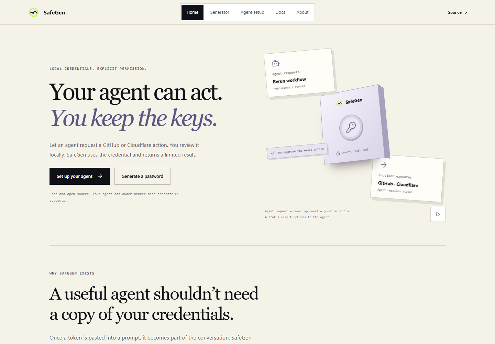

<p align="center"></p>

# SafeGen

**Useful agents. Credentials that stay under your control.**

SafeGen lets agents request approved GitHub, Cloudflare, and npm actions without receiving the provider credentials used to perform them. It also includes a browser-local password generator and a TypeScript generation library.

[Website](https://safegen.poorvithmp.com) · [Try the generator](https://safegen.poorvithmp.com/generator) · [Connect your agent](https://safegen.poorvithmp.com/setup) · [Documentation](https://safegen.poorvithmp.com/docs)



## Choose your starting point

| You want to… | Start here |
| --- | --- |
| Generate a password, passphrase, PIN or pattern | [Browser generator](https://safegen.poorvithmp.com/generator), no account needed |
| Set up Codex, Claude Code or Cursor | [Getting started](docs/getting-started.md) and the [interactive setup guide](https://safegen.poorvithmp.com/setup) |
| Prepare the private owner environment | [Owner isolation](docs/isolation.md) |
| Understand or extend the code | [Architecture](docs/architecture.md), [maintenance](docs/maintenance.md), [CLI](packages/cli/README.md), [core API](packages/core/README.md) |

The mission is to make credential access an explicit, reviewable action. A prompt asking an AI to keep a token private is not an isolation boundary. SafeGen keeps authentication in a separately controlled owner environment.

## How agent access works

1. The owner creates an encrypted vault and pins each connection to a GitHub repository, Cloudflare Worker, or npm package.
2. The owner starts the broker in a separate standard OS account and opens its control page in a private login session that the agent cannot inspect or automate.
3. The agent uses the CLI or MCP client to request a named action. It receives a pending request ID.
4. The owner approves the exact account, target and parameters locally (supplying their 2FA OTP for sensitive actions like npm publish). Requests expire after two minutes and approvals cannot be reused.
5. SafeGen calls the intended provider directly. The agent receives a small, validated status result. It never receives the provider token, master password, control-page link, cookies or raw provider response.

| Integration | Actions | Owner pins | Agent supplies |
| --- | --- | --- | --- |
| GitHub | Workflow run status; rerun an existing workflow | Repository | Run ID |
| Cloudflare | Recent Worker deployments; deploy an existing version to 100% | Account and Worker | Immutable version ID for deployment |
| npm | View latest published semver; publish approved tarball | Package and allowed tarball directory | Tarball path and version (owner supplies 2FA OTP at approval) |

There is no arbitrary HTTP proxy, command execution or code upload tool. Provider redirects are rejected. Errors returned to agents use fixed messages. Locking revokes pending actions and aborts in-flight requests locally; a provider may still complete an action it has already received.

## Architecture comparison: Action-only vs Token-release

SafeGen operates an **action-only** model, distinct from token-release credential managers.

| Dimension | Token-release brokers (e.g. [1Password Credential Broker](https://developer.1password.com/docs/service-accounts/credential-broker/)) | SafeGen Action Broker |
| --- | --- | --- |
| Credential exposure | Releases raw provider tokens/credentials to the requesting client | Zero credential disclosure; credentials never enter the agent context |
| Blast radius | Agent can use released credentials for any endpoint allowed by token scope | Agent can only trigger the exact approved action against the pinned target |
| Lifecycle | Token remains in agent memory/environment until revoked or expired | Token stays inside owner process; used once for the approved action and dropped |
| 2FA / OTP | Requires delegating 2FA secrets or pre-authenticated sessions | Owner supplies 2FA OTP interactively at approval time; OTP is never stored |
| Residual risks | Process memory dumps, accidental prompt leakage, unapproved API calls | Host root/admin compromise, shared screen automation, malicious provider behavior |

No security architecture offers "zero risk" or "unhackable" operations. SafeGen narrows the exposure surface by keeping provider credentials completely out of agent memory and context.

## Release status and installation

This repository contains CLI **3.1.0** and core **2.2.0**. The action broker is a breaking change from CLI v2.

Install the CLI globally in **each standard OS account separately** (the owner account and the agent account must each have their own independent installation; never share an installation or home directory between accounts):

```powershell
npm install -g @poorvithmp/safegen-cli@3.1.0
safegen --help
```

To build from source:

```powershell
git clone https://github.com/poorvith-mp/safegen.git
cd safegen
npm ci
npm run build:packages
node packages/cli/dist/index.js --help
```

The CLI requires Node 22.13 or newer. See the [owner setup guide](docs/isolation.md) before storing a real credential. The agent account needs only its own CLI/MCP installation and the loopback endpoint; never share the owner's checkout or home directory.

## Browser generator

The website generates random passwords, EFF passphrases, PINs and custom patterns using Web Crypto. Generation doesn't upload secrets or load analytics. The application shell can be reopened offline after its first successful load.

Copied history stays in memory by default. Persistent history is an explicit opt-in and remains **unencrypted** in the browser profile. Exported history is also sensitive. The website is not the owner control page and never connects to your local broker.

Strength figures describe generation assumptions. They cannot establish the strength of an arbitrary human-chosen password or guarantee a cracking time. Don't reuse generated passwords.

## Local vault and trust boundary

The vault uses AES-256-GCM with Envelope v2 and scrypt ($N=131072, r=8, p=1$, maxmem 256 MiB), with backwards compatibility for Envelope v1 PBKDF2 vaults. Initialization never overwrites a vault. Mutations are serialized across processes. Transparent upgrade from v1 to v2 scrypt occurs on password rotation or save (`vault upgraded to scrypt` notice). Encrypted backup/restore (`safegen vault backup/restore`), KDF inspection (`safegen vault kdf`), and audit trail export (`safegen broker audit`) are available; losing the master password has no recovery path.

The owner broker auto-locks after five minutes. Connection revocation removes the grant from the running broker and its saved configuration; it does not revoke the provider's token remotely. Revoke or rotate that token at GitHub/Cloudflare/npm when needed. Configure minimum provider permissions and an expiration when creating tokens.

A second process alone isn't an isolation boundary. **The agent must not have access to the owner's OS account, browser session, vault, broker code, runtime, or process memory.** Startup checks reject the same username and inspect basic OS/file permissions; they do not certify the complete machine configuration. Administrator/root access, shared screen/input automation, a compromised broker/runtime, malicious provider behavior, and OS compromise remain outside this model. Approved nonsecret results may reach the model provider.

## Development and deployment

```powershell
npm test
npm run lint
npm run build
npm run dev
```

`npm run test:browser` checks a production preview at `http://127.0.0.1:4173` using an existing Playwright installation. Start `npm run preview` first. Set `SAFEGEN_PLAYWRIGHT_MODULE` to an existing Playwright module entry if it isn't installed in the checkout, and `SAFEGEN_BROWSER_CHANNEL=msedge` to use an installed Edge browser. The smoke test uses a fresh profile and synthetic data; it checks offline loading, copy failures, history consent and unauthorized network calls. No browser automation dependency is bundled in production.

Cloudflare Workers serves the static website through the existing Git integration. Build checks run tests and lint before producing assets. Only the public generator is deployed; vaults and the broker remain on the owner's machine. Native static-asset headers enforce the website's content and framing policy.

The response policy also uses `no-transform` to prevent Cloudflare's automatic Web Analytics injection, as described in its [Web Analytics FAQ](https://developers.cloudflare.com/web-analytics/faq/). Offline caching fetches the canonical root page because Cloudflare redirects `/index.html`.

The generator core has no runtime dependencies. The broker reuses Node built-ins and the existing MCP SDK, Commander, Inquirer and Zod. Contributions that change secret handling need regression tests and a clear statement of the affected trust boundary.

## About the builder

Built by [Poorvith M P](https://www.poorvithmp.com), a tools architect in Hassan, Karnataka, working on agent systems and local-first utilities. I build around the friction people learn to tolerate, with useful behavior and visible engineering tradeoffs.

[GitHub](https://github.com/poorvith-mp) · [Contact](mailto:contact@poorvithmp.com) · [Feature scope and next work](features.md)

MIT. The EFF wordlist has its own attribution in the core package. Supported client marks belong to their respective owners; see [asset attribution](docs/assets/ATTRIBUTION.md).
