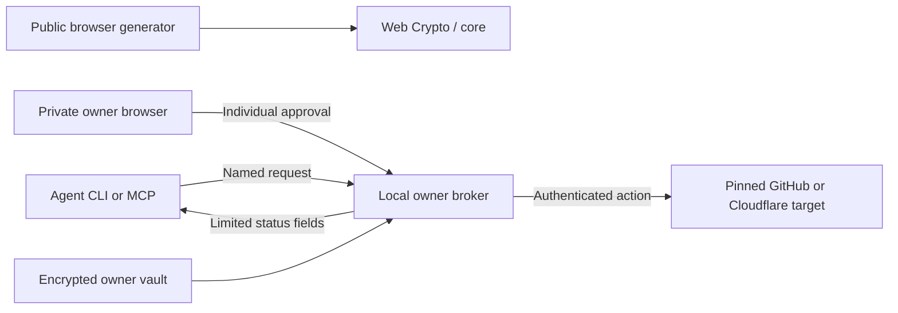

# Architecture

SafeGen's mission is to keep provider credentials out of agent context while allowing narrowly approved work. It has three entry points that share a repository, not a credential channel.

## Source map

| Location | Responsibility |
| --- | --- |
| `src/App.tsx` | Browser routes and generator state |
| `src/components/` | Landing, generator, setup, handbook, about and shared interface |
| `src/context/HistoryContext.tsx` | Memory history and explicit plaintext persistence consent |
| `packages/core/src/` | Cryptographic generation and strength estimation |
| `packages/cli/src/` | CLI commands, vault and MCP integration |
| `packages/cli/src/broker/server.ts` | Owner control page, approval lifecycle and agent endpoints |
| `packages/cli/src/broker/actions.ts` | Fixed provider adapters and result validation |
| `public/sw.js` | Same-origin public app-shell offline cache |
| `public/_headers` | Static asset response policies |
| `tests/`, `scripts/browser-smoke.mjs` | Core/broker regressions and browser functional checks |

## Approval lifecycle

The owner pins a GitHub repository or Cloudflare account and Worker during connection setup. The agent supplies only an allowed action and validated parameters, such as an existing workflow run ID or immutable Worker version ID. Every request needs fresh owner approval and expires after two minutes. Owner unlock lasts five minutes.

The broker calls the intended provider directly, rejects redirects and returns a small validated result. It does not expose raw responses, provider tokens, master passwords or owner-control capabilities. There is no arbitrary HTTP proxy, shell tool or code-upload action. MCP exposes only connection listing, action requests and action status.

Locking or connection revocation stops new work and aborts local requests. The provider may still finish an action already received. Revoking a connection locally does not revoke its provider token remotely.

## Trust boundary

The owner account, installation, runtime, dependencies, vault and browser must be inaccessible to the agent. See [isolation](isolation.md). The startup checks inspect basic permissions; they do not provision or certify the machine. Same-user execution, agent administrator/root access, shared owner-screen automation, compromised owner software and malicious provider behavior are outside this model. Nonsecret results can enter agent/model context.

The owner vault uses AES-256-GCM and PBKDF2-HMAC-SHA256 with 600,000 iterations, a random 16-byte salt and 12-byte IV. Writes are serialized and replaced atomically. Backups remain encrypted under their original password. Browser history is separate: memory by default, plaintext when explicitly persisted or exported.

## Extending the product

A provider extension needs a named action, an owner-pinned target, strict input/output schemas and tests for destination, approval expiry and result filtering. Keep general credential export and arbitrary requests out of this interface. Crypto changes, encrypted browser bundles, short-lived provider tokens and deeper isolation verification require their own designs and security review.

UI setup prompts assist configuration; they do not enforce protection. The site never sends a request to the local broker. GSAP animates a CSS 3D illustration with reduced-motion support; no WebGL runtime or remote assets are needed.
