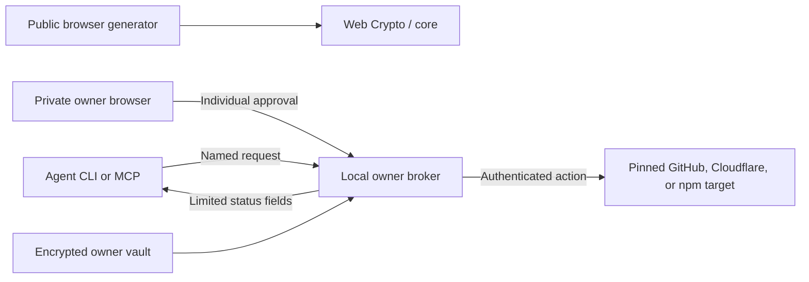

# Architecture

SafeGen's mission is to keep provider credentials out of agent context while allowing narrowly approved work. It has three entry points that share a repository, not a credential channel.

## Source map

| Location | Responsibility |
| --- | --- |
| `src/App.tsx` | Browser routes and generator state |
| `src/components/` | Landing, generator, setup, handbook, about and shared interface |
| `src/context/HistoryContext.tsx` | Memory history and explicit plaintext persistence consent |
| `packages/core/src/` | Cryptographic generation and strength estimation |
| `packages/cli/src/` | CLI commands, vault and MCP integration |
| `packages/cli/src/broker/server.ts` | Owner control page, approval lifecycle and agent endpoints |
| `packages/cli/src/broker/actions.ts` | Fixed provider adapters and result validation |
| `packages/cli/src/broker/audit.ts` | Tamper-resistant append-only audit trail and rotation |
| `packages/cli/src/broker/tarball.ts` | Bounded tarball verification and path traversal defenses |
| `public/sw.js` | Same-origin public app-shell offline cache |
| `public/_headers` | Static asset response policies |
| `tests/`, `scripts/browser-smoke.mjs` | Core/broker regressions and browser functional checks |

## Approval lifecycle

The owner pins target resources during connection setup:
- **GitHub**: Repository name (actions: `github.run-status`, `github.rerun`).
- **Cloudflare**: Account ID and Worker name (actions: `cloudflare.deployments`, `cloudflare.deploy-version`).
- **npm**: Package name and absolute allowed tarball directory (actions: `npm.view-latest`, `npm.publish-tarball`).

The agent supplies only an allowed action and validated parameters (e.g., a workflow run ID, immutable Worker version ID, or tarball path + semver). Every request needs fresh owner approval and expires after two minutes. Owner unlock lasts five minutes. For npm publishing, the owner supplies their 6-digit 2FA OTP directly into the private owner approval card.

The broker calls the intended provider directly, rejects redirects and returns a small validated result. It does not expose raw responses, provider tokens, master passwords or owner-control capabilities. There is no arbitrary HTTP proxy, shell tool or code-upload action. MCP exposes only connection listing, action requests and action status.

Locking or connection revocation stops new work and aborts local requests. The provider may still finish an action already received. Revoking a connection locally does not revoke its provider token remotely.

## Architecture comparison: Action-only vs Token-release

SafeGen adheres to an **action-only** model rather than a **token-release** model.

| Dimension | Token-release brokers (e.g. [1Password Credential Broker](https://developer.1password.com/docs/service-accounts/credential-broker/)) | SafeGen Action Broker |
| --- | --- | --- |
| Credential exposure | Releases raw provider tokens/credentials to the requesting client | Zero credential disclosure; tokens never enter the agent process or conversation |
| Blast radius | Agent can use released credentials for any endpoint allowed by token scope | Agent can only trigger the exact approved action against the pinned target |
| Lifecycle | Token remains in agent memory/environment until revoked or expired | Token stays inside owner process; used once for the approved action and dropped |
| 2FA / OTP | Requires delegating 2FA secrets or pre-authenticated sessions | Owner supplies 2FA OTP interactively at approval time; OTP is never stored |
| Residual risks | Process memory dumps, accidental prompt leakage, unapproved API calls | Host root/admin compromise, shared screen automation, malicious provider behavior |

No security tool provides "zero risk" or "unhackable" operations. SafeGen narrows the attack surface by ensuring that even a fully compromised agent context contains zero provider credentials.

## Trust boundary and vault encryption

The owner account, installation, runtime, dependencies, vault and browser must be inaccessible to the agent. See [isolation](isolation.md). The startup checks inspect basic permissions; they do not provision or certify the machine. Same-user execution, agent administrator/root access, shared owner-screen automation, compromised owner software and malicious provider behavior are outside this model. Nonsecret results can enter agent/model context.

The owner vault uses **AES-256-GCM with Envelope v2**:
- **Key derivation**: Defaults to `scrypt` ($N=131072, r=8, p=1$, maxmem 256 MiB) with a random 16-byte salt and 12-byte IV.
- **Backwards compatibility**: Decrypts Envelope v1 vaults using PBKDF2-HMAC-SHA256 (600,000 iterations).
- **Upgrade on write**: Any password rotation or save operation against a v1 vault automatically upgrades the envelope to v2 scrypt (printing `vault upgraded to scrypt` once to stderr). Reading an Envelope v2 vault requires SafeGen CLI ≥ 3.1.0.
- **Bounds checking**: Strict parameter bounds ($N \in [2^{14}, 2^{20}]$ power-of-two, $r \in [8, 16], p \in [1, 4]$, PBKDF2 iterations $\in [600\,000, 5\,000\,000]$) are validated prior to derivation to prevent memory exhaustion attacks.
- Writes are serialized and replaced atomically. Backups remain encrypted under their original password. Browser history is separate: memory by default, plaintext when explicitly persisted or exported.

## Extending the product

A provider extension needs a named action, an owner-pinned target, strict input/output schemas and tests for destination, approval expiry and result filtering. Keep general credential export and arbitrary requests out of this interface. Crypto changes, encrypted browser bundles, short-lived provider tokens and deeper isolation verification require their own designs and security review.

UI setup prompts assist configuration; they do not enforce protection. The site never sends a request to the local broker. GSAP animates a CSS 3D illustration with reduced-motion support; no WebGL runtime or remote assets are needed.
