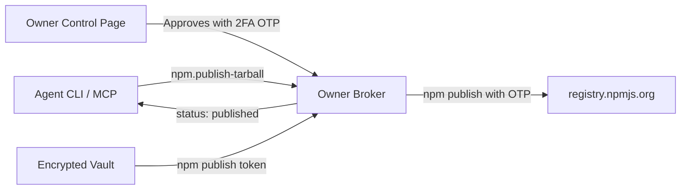

# npm Integration

The SafeGen npm provider enables an agent to view package release information and request publishing pre-built tarballs without ever holding an npm access token or publish credentials.



## Connecting an npm package (Owner Terminal)

The owner pins the npm package name and an allowed directory for tarballs. Tarballs outside this directory are strictly rejected.

```powershell
safegen broker connect `
  --provider npm `
  --name pkg `
  --package @poorvithmp/safegen-cli `
  --tarball-dir "C:\Users\owner\artifacts"
```

The CLI prompts for:
1. Scoped npm publish token (stored in the encrypted vault under `safegen:npm`).
2. Vault master password.

## Supported Actions

### 1. `npm.view-latest`

Queries `https://registry.npmjs.org/<package>` and extracts the current latest version tag.

**Agent command:**
```powershell
safegen action request --connection pkg --action npm.view-latest
```

**Validated result:**
```json
{
  "action": "npm.view-latest",
  "package": "@poorvithmp/safegen-cli",
  "latest": "3.1.0"
}
```

### 2. `npm.publish-tarball`

Requests publication of a prepared `.tgz` package file located within the owner's configured `--tarball-dir`.

**Agent command:**
```powershell
safegen action request `
  --connection pkg `
  --action npm.publish-tarball `
  --tarball-path "C:\Users\owner\artifacts\poorvithmp-safegen-cli-3.1.0.tgz" `
  --version "3.1.0"
```

**Owner Approval:**
The approval card in the private owner browser displays:
- Package name and requested semver
- Tarball SHA-256 hash and byte size
- Form field for the owner's 6-digit npm 2FA OTP

**Execution:**
Upon approval, the broker executes:
```bash
npm publish <tarballPath> --access public --otp <otp>
```
with the granular publish token supplied in process environment variables (`NODE_AUTH_TOKEN`, `NPM_TOKEN`).

## Security Invariants

- **Path traversal prevention**: Tarball paths are resolved using `realpathSync`. Paths containing `..` or symlinks escaping `--tarball-dir` fail closed with `tarball not allowed`.
- **Version verification**: The broker inspects the inner `package/package.json` inside the `.tgz` archive. If the archive's internal version differs from the requested version, the action fails closed with `version mismatch`.
- **Server-side OTP enforcement**: An approval without a valid 6-digit numeric OTP is rejected server-side with HTTP 400.
- **Zero credential disclosure**: The npm token and 2FA OTP are never logged to `activity.jsonl` or `broker-audit.jsonl`, never stored, and never revealed to the agent.
